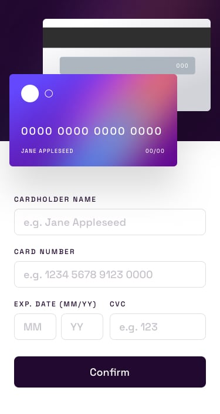

# Frontend Mentor - Solução do formulário de detalhes do cartão


# Esta é uma solução para o Desafio de formulário de detalhes interativos do cartão no [Frontend Mentor](https://www.frontendmentor.io/challenges/interactive-card-details-form-XpS8cKZDWw). 

## 📖 Ìndice

- [Meu processo](#meu-processo)
- [O desafio](#o-desafio)
- [Recursos utilizados](#Recursos-utilizados)
- [Aprendizado](#Aprendizado)
- [Imagem Demonstração](#imagem_demosntracao)
- [Autor](#Autor)

# ⭐ Meu processo

- Utilizando o VS Code conectado a minha conta do GitHub, desenvolvi uma página em HTML, CSS e JavaScript, responsivo, para a visualização do desafio de criar um formulário interativo [Frontend Mentor](https://www.frontendmentor.io/challenges/interactive-card-details-form-XpS8cKZDWw) e concluir o desafio de codificação criado.

# ⭐ O desafio
O desafio é criar um formulário interativo de detalhes do cartão e deixá-lo o mais próximo possível do design.
## Seus usuários devem ser capazes de:
Preencher o formulário e ver os detalhes do cartão atualizados em tempo real
Receba mensagens de erro quando o formulário for enviado se:
Qualquer campo de entrada está vazio
O número do cartão, a data de validade ou os campos CVC estão no formato errado

Visualize o layout ideal dependendo do tamanho da tela do dispositivo.


# ⭐ Recursos utilizados


- Visual Studio Code
- Marcação semântica HTML5
- Propriedades personalizadas do CSS
- Modelos de caixa
- Flexbox
- Funções JavaScript
- Fluxo de trabalho que prioriza dispositivos móveis
- [Markdown Badges](https://github.com/Ileriayo/markdown-badges#markdown-badges)
- [Como escrever no GitHub](https://docs.github.com/pt/get-started/writing-on-github)

# ⭐ Aprendizado

Aprendi a adicionar códigos em JavaScript como constantes e funções.
```
const inputNome = document.getElementById("input-nome");
const inputNumero = document.getElementById("input-numero");
const inputMes = document.getElementById("input-mes");
const inputAno = document.getElementById("input-ano");
const inputCVC = document.getElementById("input-cvc");
```
```
  function enviar(e){
    e.preventDefault();
    if(!inputNome.value){
        inputNome.classList.add("error");
        inputNome.parentElement.classList.add("error-message");
    }
    else{
```

# 📌 Imagem Demonstração




## 🌙⭐ Autor
[](https://www.linkedin.com/in/laylafe/)
[](https://github.com/laylafe)
- Website - [Missão de Amor](https://laylafe.github.io/missaodeamor/) - Site em desenvolvimento
- Frontend Mentor - [@LaylaFe](https://www.frontendmentor.io/profile/LaylaFe)

_____________________________


## GitHub Stats

